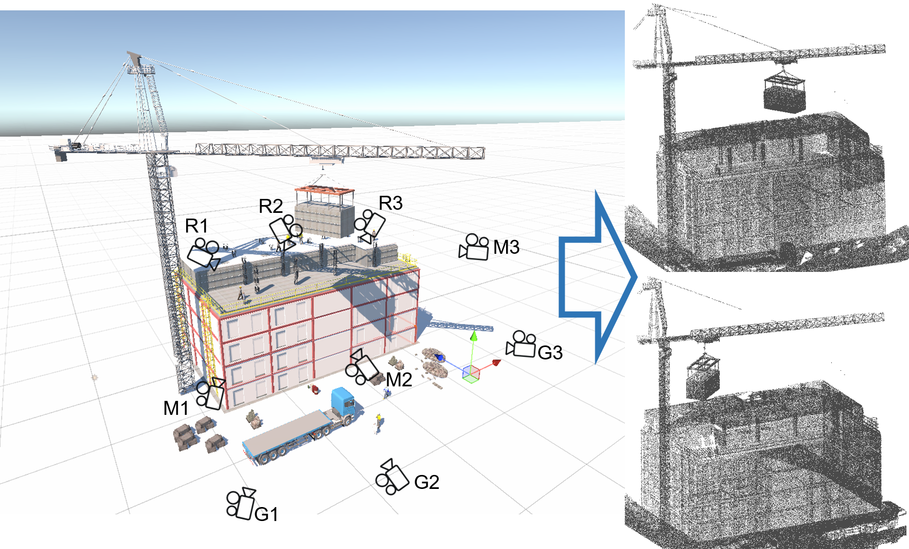

# Unity_to_pointcloud

1. Introduction
   The code repository is script code and examples of Unity-based point cloud generation method 

   1.1 Related paper
       Liang, D., Wu L. Sun, M., Hu, R., Kong L., Pan Y, & Xue, F. (2023). Transfer learning from building information model-based synthetic data for 3D module detection in point clouds of modular-integrated construction hoisting. Engineering Applications of Artificial Intelligence, Under review
   1.2 Related video
       Our accompanying videos are now available on YouTube (click below images to open) 
       
   1.3 Related example project and data
       
   

3. Prerequisites
   2.1 Unity environment
       Unity editor version 2022.3.55f1
   2.2 For training in OpenPCDet
       
   
